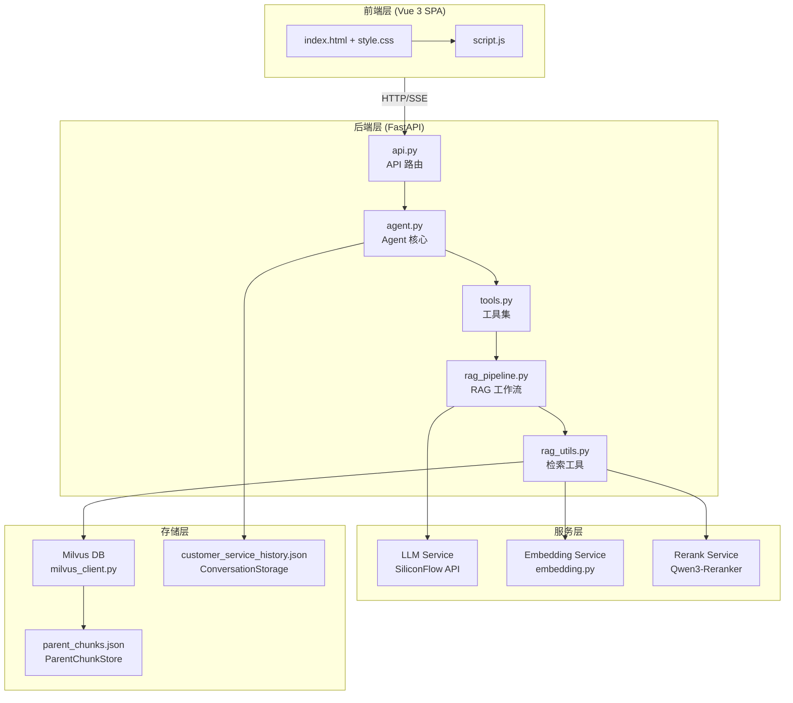
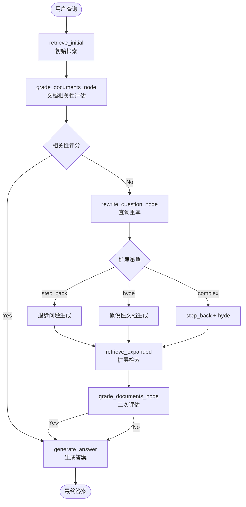
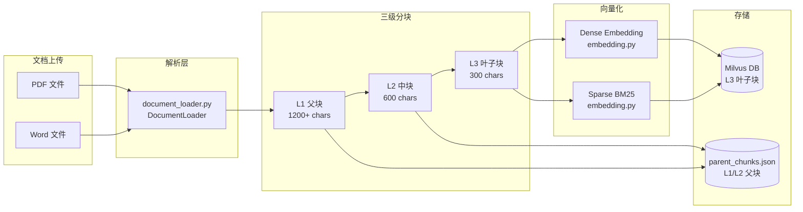
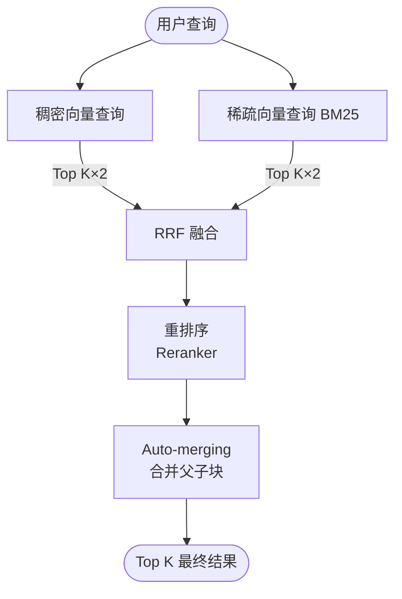
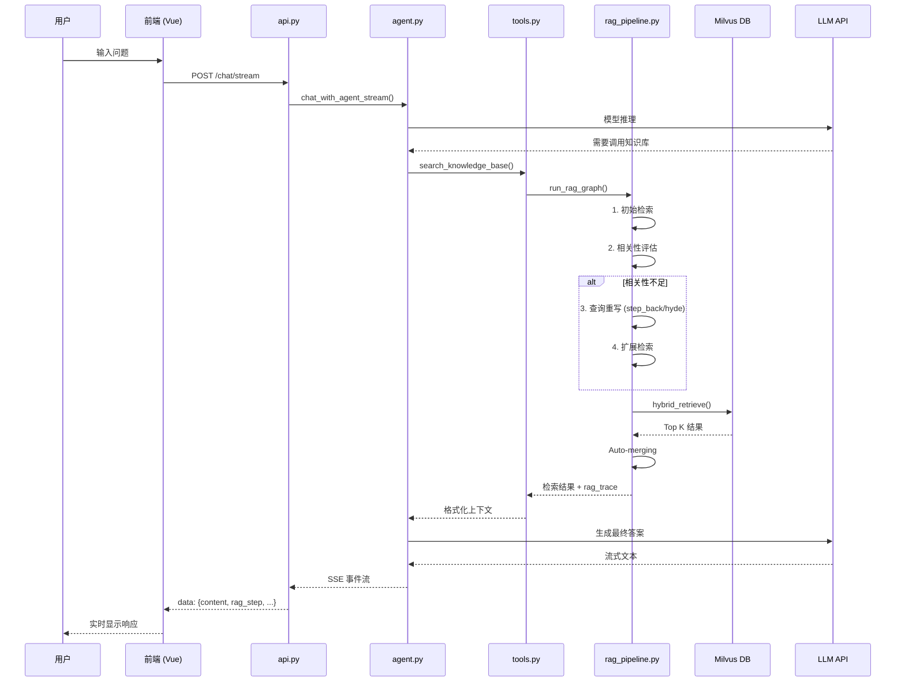
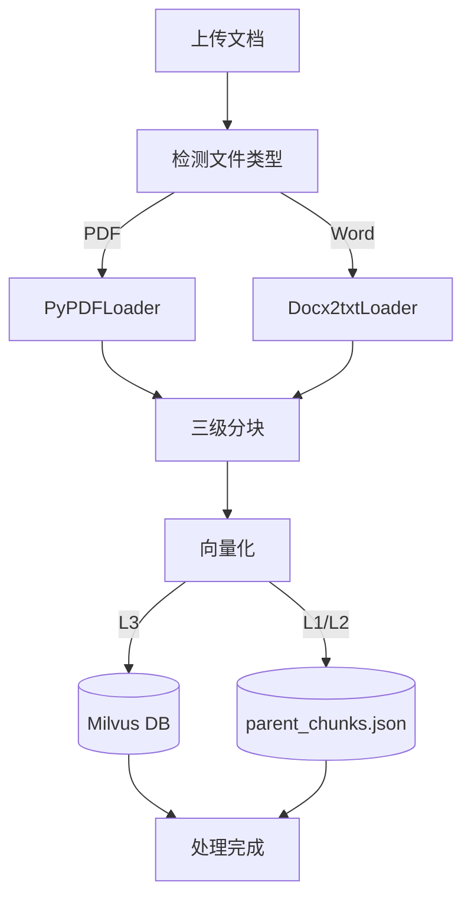

# SuperMew 系统架构文档

## 版本信息

- **文档版本**: v1.0
- **生成日期**: 2026-03-20
- **项目版本**: 0.1.0

---

## 1. 系统概述

### 1.1 项目简介

SuperMew 是一个基于 **FastAPI + LangChain + Milvus** 构建的智能客服助手系统，集成了先进的 **RAG (Retrieval-Augmented Generation)** 技术，支持混合向量检索、自动文档合并和流式对话输出。

### 1.2 核心能力

- 💬 **智能对话**: 基于大语言模型的自然语言交互
- 📚 **知识库检索**: 混合检索 (Dense + Sparse + RRF) + 重排序
- 📄 **文档处理**: 支持 PDF/Word 文档的智能分块和向量化
- 🔄 **Auto-merging**: 自动合并相关检索片段，提升上下文完整性
- 🌊 **流式输出**: 实时流式响应，支持 RAG 步骤可视化追踪
- 💾 **会话记忆**: 智能会话管理和上下文保持

---

## 2. 技术栈

### 2.1 后端技术栈

| 层级 | 技术 | 版本 | 用途 |
|------|------|------|------|
| Web 框架 | FastAPI | ≥0.115.0 | REST API 服务 |
| Agent 框架 | LangChain | ≥0.3 | Agent 构建和工具调用 |
| 工作流引擎 | LangGraph | ≥0.2.31 | RAG 管道编排 |
| 向量数据库 | Milvus | 2.5+ | 混合向量存储和检索 |
| 嵌入模型 | Qwen3-Embedding-4B | - | 稠密向量生成 |
| 重排序模型 | Qwen3-Reranker-4B | - | 检索结果重排序 |
| LLM | Qwen3.5-122B-A10B | - | 主模型推理 |
| 数据验证 | Pydantic | ≥2.8.0 | 数据模型定义 |
| 文档解析 | PyPDFLoader, Docx2txt | - | PDF/Word 解析 |

### 2.2 前端技术栈

| 技术 | 用途 |
|------|------|
| Vue 3 | 前端框架 |
| Marked.js | Markdown 渲染 |
| Highlight.js | 代码高亮 |
| SSE | 服务器推送事件 (流式输出) |

### 2.3 基础设施

| 组件 | 用途 |
|------|------|
| Docker Compose | Milvus 容器编排 |
| python-dotenv | 环境变量管理 |
| uvicorn | ASGI 服务器 |

---

## 3. 系统架构图

### 3.1 整体架构



### 3.2 RAG 管道架构



### 3.3 文档处理流程



### 3.4 混合检索架构



---

## 4. 核心模块分析

### 4.1 API 层 (`api.py`)

**职责**: HTTP 接口定义和请求处理

**主要端点**:

| 端点 | 方法 | 功能 |
|------|------|------|
| `/chat` | POST | 非流式对话 |
| `/chat/stream` | POST | 流式对话 (SSE) |
| `/sessions/{user_id}` | GET | 获取用户会话列表 |
| `/sessions/{user_id}/{session_id}` | GET | 获取会话消息 |
| `/sessions/{user_id}/{session_id}` | DELETE | 删除会话 |
| `/documents` | GET | 文档列表 |
| `/documents/upload` | POST | 上传文档 |
| `/documents/{filename}` | DELETE | 删除文档 |

**设计模式**: 
- RESTful API 设计
- Pydantic 请求/响应模型验证
- SSE (Server-Sent Events) 实现流式输出

### 4.2 Agent 核心 (`agent.py`)

**职责**: LangChain Agent 创建和对话管理

**关键组件**:

```python
class ConversationStorage:
    """对话存储 - 持久化会话数据到 JSON"""
    
class SummarizationMiddleware:
    """摘要中间件 - Token 超过 80000 时触发摘要"""
```

**Agent 配置**:
- 模型: Qwen3.5-122B-A10B
- 工具: `get_current_weather`, `search_knowledge_base`
- 系统提示: `backend/soul/soul.md`
- 摘要触发: 80000 tokens
- 保留消息: 最近 12 条 (6 轮交互)

**对话流程**:
1. 加载历史会话
2. 清理残留 RAG 上下文
3. 调用 Agent 处理消息
4. 提取 RAG 追踪信息
5. 保存对话到存储

### 4.3 RAG 管道 (`rag_pipeline.py`)

**职责**: 基于 LangGraph 的检索增强生成工作流

**状态定义** (`RAGState`):
```python
class RAGState(TypedDict):
    question: str          # 原始问题
    query: str            # 检索查询
    context: str          # 格式化上下文
    docs: List[dict]      # 检索文档
    route: Optional[str]  # 路由决策
    expansion_type: Optional[str]  # 扩展策略
    rag_trace: Optional[dict]     # 追踪信息
```

**工作流节点**:
1. `retrieve_initial`: 初始检索
2. `grade_documents_node`: 文档相关性评估
3. `rewrite_question_node`: 查询重写和扩展
4. `retrieve_expanded`: 扩展检索
5. `generate_answer`: 答案生成

### 4.4 检索工具 (`rag_utils.py`)

**职责**: 混合检索和文档处理

**核心功能**:

#### 4.4.1 混合检索 (`hybrid_retrieve`)
```python
def hybrid_retrieve(query: str, top_k: int = 5) -> dict:
    # 1. 生成稠密向量 + 稀疏向量
    # 2. 并行执行两种检索
    # 3. RRF 融合结果
    # 4. 可选重排序
    # 5. Auto-merging 合并父子块
```

#### 4.4.2 Auto-merging 机制
```python
def _merge_to_parent_level(docs, threshold=2):
    # 将连续的 L3/L2 块合并到父级 L2/L1
    # 提升上下文完整性
```

#### 4.4.3 重排序 (`_rerank_documents`)
- 使用 Qwen3-Reranker 模型
- 提升检索精度

### 4.5 向量服务 (`embedding.py`)

**职责**: 文本向量化和 BM25 计算

**双向量策略**:

| 向量类型 | 维度 | 用途 | 算法 |
|---------|------|------|------|
| 稠密向量 | 2560 | 语义相似性 | Qwen3-Embedding-4B |
| 稀疏向量 | 动态 | 关键词匹配 | BM25 |

**BM25 参数**:
- `k1 = 1.5`: 词频饱和参数
- `b = 0.75`: 文档长度归一化

### 4.6 Milvus 客户端 (`milvus_client.py`)

**职责**: 向量数据库操作

**集合 Schema**:
```python
{
    "id": INT64,              # 主键 (auto_id)
    "dense_embedding": FLOAT_VECTOR[2560],
    "sparse_embedding": SPARSE_FLOAT_VECTOR,
    "text": VARCHAR[2000],
    "filename": VARCHAR[255],
    "file_type": VARCHAR[50],
    "chunk_id": VARCHAR[512],
    "parent_chunk_id": VARCHAR[512],
    "root_chunk_id": VARCHAR[512],
    "chunk_level": INT64,     # 1/2/3
}
```

**索引配置**:
- Dense: HNSW (M=16, efConstruction=256)
- Sparse: SPARSE_INVERTED_INDEX (drop_ratio_build=0.2)

### 4.7 文档加载器 (`document_loader.py`)

**职责**: PDF/Word 文档解析和三级分块

**三级滑动窗口**:

| 层级 | 块大小 | 重叠 | 数量比 |
|------|--------|------|--------|
| L1 父块 | 1200+ chars | 240+ chars | 1x |
| L2 中块 | 600 chars | 120 chars | ~3x |
| L3 叶子块 | 300 chars | 60 chars | ~10x |

**分块标识**:
```python
chunk_id = "{filename}::p{page}::l{level}::{index}"
```

**存储策略**:
- L1/L2: 仅存储在 `parent_chunks.json`
- L3: 写入 Milvus (用于检索)

### 4.8 工具集 (`tools.py`)

**职责**: Agent 可调用的外部工具

| 工具 | 功能 | 数据源 |
|------|------|--------|
| `get_current_weather` | 天气查询 | 高德地图 API |
| `search_knowledge_base` | 知识库检索 | RAG Pipeline |

**RAG 步骤推送机制**:
```python
def emit_rag_step(icon, label, detail):
    """跨线程安全地推送 RAG 步骤到 SSE 队列"""
```

### 4.9 前端 (`frontend/script.js`)

**职责**: 用户界面和交互逻辑

**核心功能**:

1. **流式对话处理**
   ```javascript
   // SSE 事件类型
   - content: 文本片段
   - rag_step: RAG 步骤更新
   - trace: RAG 追踪信息
   - error: 错误信息
   ```

2. **会话管理**
   - 用户/会话 ID 生成和持久化
   - 历史消息加载和展示

3. **Markdown 渲染**
   - Marked.js 解析
   - Highlight.js 代码高亮

---

## 5. 数据流分析

### 5.1 对话请求流程



### 5.2 文档上传流程



---

## 6. API 详细文档

### 6.1 聊天接口

#### POST `/chat`

非流式对话接口

**请求**:
```json
{
    "message": "用户问题",
    "user_id": "user_123",
    "session_id": "session_456"
}
```

**响应**:
```json
{
    "response": "AI 回复内容",
    "rag_trace": {
        "tool_used": true,
        "tool_name": "search_knowledge_base",
        "query": "用户问题",
        "retrieved_chunks": [...]
    }
}
```

#### POST `/chat/stream`

流式对话接口 (SSE)

**请求**: 同 `/chat`

**响应格式**:
```
data: {"type": "content", "content": "部分文本"}
data: {"type": "rag_step", "step": {"icon": "🔍", "label": "检索中..."}}
data: {"type": "trace", "rag_trace": {...}}
data: {"type": "error", "content": "错误信息"}
data: [DONE]
```

### 6.2 会话管理

#### GET `/sessions/{user_id}`

获取用户所有会话

**响应**:
```json
{
    "sessions": [
        {
            "session_id": "session_1",
            "updated_at": "2026-03-20T10:00:00",
            "message_count": 10
        }
    ]
}
```

#### GET `/sessions/{user_id}/{session_id}`

获取指定会话消息

**响应**:
```json
{
    "messages": [
        {
            "type": "human",
            "content": "用户消息",
            "timestamp": "2026-03-20T10:00:00",
            "rag_trace": null
        },
        {
            "type": "ai",
            "content": "AI回复",
            "timestamp": "2026-03-20T10:00:01",
            "rag_trace": {...}
        }
    ]
}
```

### 6.3 文档管理

#### POST `/documents/upload`

上传文档

**请求**: `multipart/form-data`
- `file`: PDF 或 Word 文件

**响应**:
```json
{
    "filename": "document.pdf",
    "chunks_processed": 150,
    "message": "文档上传成功"
}
```

#### GET `/documents`

获取文档列表

**响应**:
```json
{
    "documents": [
        {
            "filename": "product_manual.pdf",
            "file_type": "PDF",
            "chunk_count": 150
        }
    ]
}
```

---

## 7. 配置管理

### 7.1 环境变量 (`.env`)

```bash
# ===== API 配置 =====
API_KEY=your_api_key_here
BASE_URL=https://api.siliconflow.cn/v1

# ===== 模型配置 =====
MODEL=Qwen/Qwen3.5-122B-A10B
EMBEDDER=Qwen/Qwen3-Embedding-4B
RERANK_MODEL=Qwen/Qwen3-Reranker-4B
GRADE_MODEL=Qwen/Qwen3.5-122B-A10B

# ===== Milvus =====
MILVUS_HOST=127.0.0.1
MILVUS_PORT=19530
MILVUS_COLLECTION=embeddings_collection

# ===== Auto-merging =====
AUTO_MERGE_ENABLED=true
AUTO_MERGE_THRESHOLD=2
LEAF_RETRIEVE_LEVEL=3

# ===== 天气服务 =====
AMAP_WEATHER_API=https://restapi.amap.com/v3/weather
AMAP_API_KEY=your_amap_key

# ===== 服务器 =====
HOST=127.0.0.1
PORT=8000
```

---

## 8. 部署架构

### 8.1 开发环境

```bash
# 1. 安装依赖
uv sync

# 2. 启动 Milvus
docker compose up -d

# 3. 启动后端
uv run uvicorn backend.app:app --host 127.0.0.1 --port 8000 --reload

# 4. 访问
# 前端: http://127.0.0.1:8000/
# API 文档: http://127.0.0.1:8000/docs
```

### 8.2 Docker Compose 配置

```yaml
# docker-compose.yml
services:
  milvus-etcd:
    image: quay.io/coreos/etcd:v3.5.5
    environment:
      - ETCD_AUTO_COMPACTION_MODE=revision
      - ETCD_AUTO_COMPACTION_RETENTION=1000
      - ETCD_QUOTA_BACKEND_BYTES=4294967296
      - ETCD_SNAPSHOT_COUNT=50000
    volumes:
      - ./volumes/etcd:/etcd
    command: etcd -advertise-client-urls=http://127.0.0.1:2379 -listen-client-urls http://0.0.0.0:2379 --data-dir /etcd

  milvus-minio:
    image: minio/minio:RELEASE.2023-03-20T20-16-18Z
    environment:
      MINIO_ACCESS_KEY: minioadmin
      MINIO_SECRET_KEY: minioadmin
    ports:
      - "9001:9001"
      - "9000:9000"
    volumes:
      - ./volumes/minio:/minio_data
    command: minio server /minio_data --console-address ":9001"

  milvus-standalone:
    image: milvusdb/milvus:v2.5.0
    command: ["milvus", "run", "standalone"]
    environment:
      ETCD_ENDPOINTS: milvus-etcd:2379
      MINIO_ADDRESS: milvus-minio:9000
    volumes:
      - ./volumes/milvus:/var/lib/milvus
    ports:
      - "19530:19530"
      - "9091:9091"
    depends_on:
      - milvus-etcd
      - milvus-minio
```

---

## 9. 目录结构

```
SuperMew/
├── backend/                     # FastAPI 后端
│   ├── __init__.py
│   ├── app.py                   # FastAPI 应用入口
│   ├── api.py                   # API 路由定义
│   ├── agent.py                 # LangChain Agent 核心
│   ├── config.py                # 配置管理
│   ├── schemas.py               # Pydantic 数据模型
│   ├── tools.py                 # Agent 工具集
│   ├── soul/
│   │   └── soul.md              # Agent 系统提示词
│   ├── rag_pipeline.py          # LangGraph RAG 工作流
│   ├── rag_utils.py             # 检索工具函数
│   ├── embedding.py             # 稠密 + BM25 向量化
│   ├── milvus_client.py         # Milvus 客户端
│   ├── milvus_writer.py         # 向量写入器
│   ├── document_loader.py       # 文档解析和分块
│   └── parent_chunk_store.py     # 父级分块存储
├── frontend/                    # Vue 3 单页应用
│   ├── index.html
│   ├── script.js
│   └── style.css
├── data/                       # 本地数据存储
│   ├── customer_service_history.json  # 会话历史
│   ├── parent_chunks.json              # 父级分块
│   └── documents/                      # 上传文档
├── langchain-study/            # LangChain 学习笔记
├── docker-compose.yml          # Milvus 部署配置
├── pyproject.toml             # 项目依赖
├── CLAUDE.md                  # Claude Code 指南
└── sys-doc.md                 # 本文档
```

---

## 10. 关键技术亮点

### 10.1 三级分块 + Auto-merging

传统的固定大小分块会导致语义截断。本项目采用三级滑动窗口：

1. **L1 父块** (1200+ chars): 提供宏观上下文
2. **L2 中块** (600 chars): 平衡粒度和语义
3. **L3 叶子块** (300 chars): 精确检索单元

Auto-merging 机制在检索后自动合并相关片段，保留完整语义。

### 10.2 混合检索 + RRF 融合

结合两种检索范式：

- **稠密向量**: 捕获语义相似性
- **稀疏向量 (BM25)**: 精确关键词匹配

使用 **Reciprocal Rank Fusion (RRF)** 融合两种结果：

```
RRF_score(d) = Σ 1/(k + rank_i(d))
```

其中 `k=60` 为平滑参数。

### 10.3 查询扩展策略

针对不同问题类型采用不同策略：

| 策略 | 适用场景 | 方法 |
|------|----------|------|
| Step-back | 具体问题 | 生成高层抽象问题 |
| HyDE | 概念问题 | 生成假设性答案文档 |
| Complex | 复杂问题 | 结合两种策略 |

### 10.4 流式输出 + RAG 追踪

使用 SSE 实现实时流式响应，同时推送：

- 文本片段 (`content`)
- RAG 步骤 (`rag_step`)
- 最终追踪 (`trace`)

提供透明可追溯的推理过程。

### 10.5 智能会话管理

- **Token 限制**: 80000 tokens 触发摘要
- **消息保留**: 最近 12 条消息 (6 轮交互)
- **持久化**: JSON 文件存储

---

## 11. 性能优化建议

### 11.1 当前配置

| 参数 | 值 | 说明 |
|------|-----|------|
| RRF k | 60 | 融合平滑参数 |
| HNSW M | 16 | 邻居数 |
| HNSW efConstruction | 256 | 建设参数 |
| BM25 k1 | 1.5 | 词频饱和 |
| BM25 b | 0.75 | 长度归一化 |
| Auto-merge threshold | 2 | 合并阈值 |

### 11.2 优化方向

1. **向量索引**: 调整 HNSW 参数平衡精度和速度
2. **缓存层**: 引入 Redis 缓存热门查询结果
3. **异步处理**: 文档上传使用后台任务
4. **批量检索**: 合并高频查询

---

## 12. 维护指南

### 12.1 日志监控

关键监控指标：

- API 响应时间
- Milvus 查询延迟
- Token 使用量
- RAG 命中率

### 12.2 数据备份

定期备份：

- `data/customer_service_history.json`
- `data/parent_chunks.json`
- Milvus 集合数据

### 12.3 常见问题

| 问题 | 可能原因 | 解决方案 |
|------|----------|---------|
| 检索无结果 | Milvus 未启动 | 检查 `docker compose ps` |
| API 429 错误 | 模型限流 | 检查账号额度 |
| 文档上传失败 | 格式不支持 | 仅支持 PDF/Word |

---

## 13. 扩展指南

### 13.1 添加新工具

在 `tools.py` 中定义工具函数：

```python
@tool("tool_name")
def new_tool(param: str) -> str:
    """工具描述"""
    # 实现逻辑
    return result
```

### 13.2 自定义 RAG 节点

在 `rag_pipeline.py` 中添加节点：

```python
def custom_node(state: RAGState) -> RAGState:
    # 自定义逻辑
    return {"key": value}

# 添加到图
graph.add_node("custom", custom_node)
```

### 13.3 集成新数据源

参考现有实现添加数据源适配器：

1. 创建数据加载器
2. 实现向量化接口
3. 配置 Milvus Schema

---

*文档生成完毕 - SuperMew v0.1.0*
